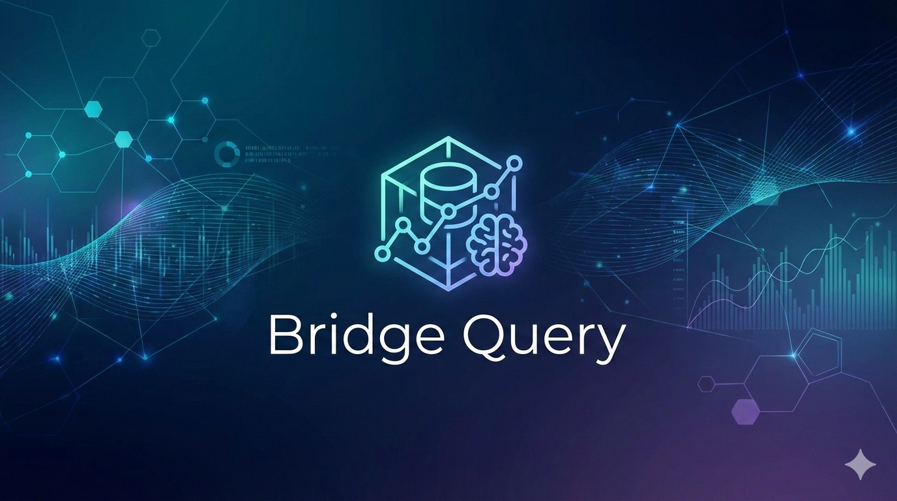

### *Bridge Query: Bridging the Gap Between Natural Language and Structured Enterprise Data*

**BridgeQuery** is a production-ready Agentic RAG system that transforms natural language into precise, secure SQL queries. Built for the modern enterprise, it handles the "messiness" of real-world data through self-healing loops, semantic business mapping, and proactive PII scrubbing.

---

## 🏗️ System Architecture

BridgeQuery is not a linear script; it is a **stateful graph** built on LangGraph.

1.  **Semantic Contextualizer:** Uses RAG to map ambiguous business terms (e.g., "Active Users") to actual database columns and logic defined in a local metadata glossary.
2.  **SQL Synthesis Node:** Generates ANSI SQL optimized for the target database.
3.  **Governance Guardrail:** Scans queries for destructive commands (`DROP`, `DELETE`) and ensures query complexity stays within safe execution limits.
4.  **Self-Correction Loop:** If the database engine returns a syntax or schema error, the agent automatically reflects on the traceback and regenerates the query (up to 3 retries).
5.  **PII Scrubber:** Intercepts data results to mask sensitive information (Emails, Phone numbers) before rendering.

---

## 🚀 Key Features

* **Self-Healing execution:** Automatically corrects its own SQL errors without user intervention.
* **Business Intelligence (BI) Glossary:** Maps "Company Talk" to "Database Reality" using a vector-indexed metadata layer.
* **Security-First Design:** Strict read-only enforcement and application-level data masking.
* **Auto-Visualization:** Intelligently chooses between tables, bar charts, or time-series plots based on result set patterns.
* **Traceability:** Fully integrated with **LangSmith** for granular debugging of the LLM's "Chain of Thought."

---

## 🛠️ Tech Stack

* **Orchestration:** LangGraph (Stateful workflows)
* **LLM:** Gemini 2.5 Flash (Context window optimized)
* **Database:** SQLite (Chinook Sample Data)
* **Vector Store:** Pinecone (Metadata retrieval)
* **Frontend:** Streamlit
* **Evaluation:** RAGAS (Faithfulness & Relevancy metrics)
